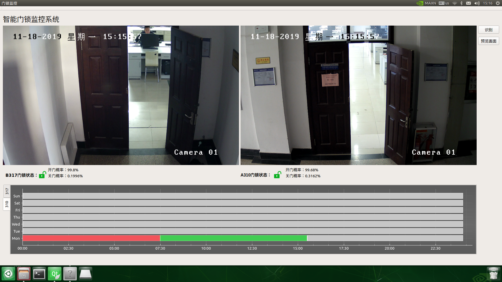
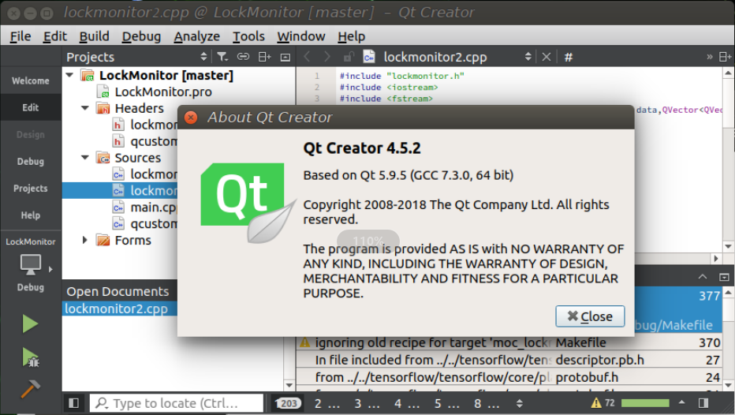

// # LockMonitor

#### 介绍
LockMonitor_linux_ubuntu_nvidia_nano
门锁监控运行在nvidia Nano上,Ubuntu系统 arm架构

#### 软件架构
软件架构说明
使用jetsonnano进行开发,使用的框架有:
- 	qt
- 	tensorflow
- 	QCustomPlot绘图库

#### 功能说明
能够使用rtsp进行远程连接海康威视的摄像头并使用tensorflow进行实时的开关门预测

#### 相关界面

